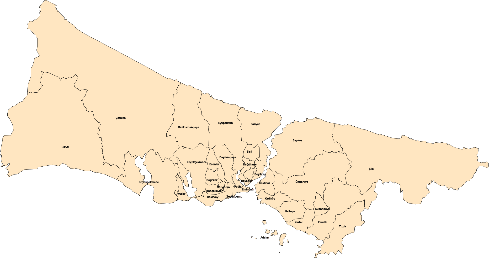

# A local's guide to Istanbul

**Disclaimer:** This guide is authentic and is not generated by any AI.

- [A local's guide to Istanbul](#a-locals-guide-to-istanbul)
  - [Basics](#basics)
    - [🏙️ European vs. Anatolian Side](#️-european-vs-anatolian-side)
  - [Public Transportation](#public-transportation)
    - [Metrobus](#metrobus)
    - [M2 \& M4 Metro Lines](#m2--m4-metro-lines)
  - [Recommended Districts and Neighbourhoods](#recommended-districts-and-neighbourhoods)
    - [Maslak](#maslak)
    - [Ataşehir](#ataşehir)
    - [Kadıköy](#kadıköy)
    - [Beşiktaş](#beşiktaş)

## Basics

Istanbul =

* 20M population (*unofficially*)
* Think of 2 cities bundled into one (*European + Anatolian sides*)
* Traffic in this city is unworldly, 20-30km/hr can be the average depending on the route and time
* People rely on two major public transportation lines:
  * Metrobus that spans the city horizontally
  * Subways to move vertically

### 🏙️ European vs. Anatolian Side

| Feature                  | ⬅️ European Side                    | ➡️ Anatolian Side                      |
|--------------------------|------------------------------------|----------------------------------------|
| **Overall vibe**         | 🚦 Chaos everywhere                 | 🍃 Chaos contained, calmer overall     |
| **Business orientation** | 🏢 Plaza heaven, highly corporate   | 🏘️ More residential, less corporate   |
| **District size**        | 📌 Small, condensed neighborhoods   | 🗺️ Larger, spacious districts         |
| **Tourism**              | 📸 Highly touristic                 | 🌳 Less touristic, local experience    |
| **Prestige**             | 💎 Generally more prestigious       | 🔸 Relatively less prestigious         |
| **Transportation**       | 🚇 Extensive but overcrowded        | 🚌 More comfortable, less crowded      |
| **Nightlife**            | 🍸 Active and vibrant               | ☕ Relaxed and local-oriented          |
| **Green Spaces**         | 🌳 Limited parks, less greenery     | 🌲 More parks and green spaces         |
| **Living Costs**         | 💰 Higher living expenses           | 💸 Slightly lower cost of living       |
| **Ideal for**            | 🎯 Young professionals, tourists    | 👨‍👩‍👧 Families, longer-term residents |

General rules of thumb when picking an office location:

* Have to stay close to the southern Bosphorus, outskirts of the city are rural and industrious
* Public transportation is a deal-breaker
* There are districts specialized for certain sectors

## Public Transportation

### [Metrobus](https://en.wikipedia.org/wiki/Metrobus_(Istanbul))

Backbone of Istanbul's public transportation. To increase the chances of accessing talent can depend on your distance to this route.

### [M2](https://en.wikipedia.org/wiki/M2_(Istanbul_Metro)) & [M4](https://en.wikipedia.org/wiki/M4_(Istanbul_Metro)) Metro Lines

One for each side, these are the main metro lines. Although there are 15 metro lines in Istanbul, the rest are either too niche or don't connect to [Metrobus](#metrobus).

## Recommended Districts and Neighbourhoods

### [Maslak](https://en.wikipedia.org/wiki/Maslak)

Manhatten of Istanbul. Full of skyscrapers and plazas, this is the B2B district. All major players have an office in one of the buildings.

Heavily utilizes [M2](https://en.wikipedia.org/wiki/M2_(Istanbul_Metro)) metro line for access. Many locals don't even consider travelling here by car if they can avoid it.

Premium service for premium cost. Avoid if you don't need the "prestige" or "B2B network".

### [Ataşehir](https://en.wikipedia.org/wiki/Ata%C5%9Fehir)

[Maslak](#maslak)'s counterpart in Anatolian side. It's a great place to be if you are a blockchain-based finance startup or a small digital agency. Since it does not connect to [Metrobus](#metrobus) directly, access from European side is limited and this shrinks the talent pool. It still has an ecosystem of its own.

Ataşehir is a huge district with a common theme everywhere, so I'd advise to be as close to [D.100 highway](https://en.wikipedia.org/wiki/State_road_D.100_(Turkey)) (locals refer it as E-5). M4 metro line follows this highway and that part is easily accessible. General advice would be to stay around [Hilton Kozyatağı](https://www.hilton.com/en/hotels/istkohi-hilton-istanbul-kozyatagi/).

### [Kadıköy](https://en.wikipedia.org/wiki/Kad%C4%B1k%C3%B6y)

You can hardly go wrong with any neighbourhood with Kadıköy, it's the "local's center" of Istanbul, considering Taksim & Sultanahmet to be the "touristic center".

Personally I'd recommend around [Koşuyolu](https://en.wikipedia.org/wiki/Ko%C5%9Fuyolu,_Kad%C4%B1k%C3%B6y) as there are many shared offices, short buildings, villas, production studios, agencies in the area with very easy access from [Ayrılık Çeşmesi](https://en.wikipedia.org/wiki/Ayr%C4%B1l%C4%B1k_%C3%87e%C5%9Fmesi_(Istanbul_Metro)) station to [Cevizağacı](https://www.google.com/maps/place/Ceviz+A%C4%9Fac%C4%B1/@41.0100207,29.0411078,17z/data=!3m1!4b1!4m6!3m5!1s0x14cab81000f162bd:0x378edcf221c4c1d7!8m2!3d41.0100207!4d29.0411078!16s%2Fg%2F11b6j70y_t?entry=ttu&g_ep=EgoyMDI1MDcxNS4xIKXMDSoASAFQAw%3D%3D) (a landmarkish bakery shop).

Average cost also should be much lower than previous options, as this district is less artificially branded as "the go-to business district".

### [Beşiktaş](https://en.wikipedia.org/wiki/Be%C5%9Fikta%C5%9F)

Similar to [Kadıköy](#kadıköy), Beşiktaş is the "local's center" in European Side, and it's slightly more prestigious, with much more traffic, similar accessibility, significantly more expensive.

Places to look for is around from [Akaretler](https://share.google/WiWOyYlnFwUcmEZST) to [Maslak](#maslak), also [Ortaköy](https://share.google/M26ePP6w5WWqkYj8f) gets a special mention.

